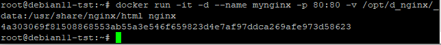
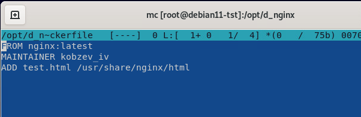

Задача 1
Сценарий выполения задачи:

создайте свой репозиторий на https://hub.docker.com;
выберете любой образ, который содержит веб-сервер Nginx;
создайте свой fork образа;
реализуйте функциональность: запуск веб-сервера в фоне с индекс-страницей, содержащей HTML-код ниже:
<html>
<head>
Hey, Netology
</head>
<body>
<h1>I’m DevOps Engineer!</h1>
</body>
</html>
Опубликуйте созданный форк в своем репозитории и предоставьте ответ в виде ссылки на https://hub.docker.com/username_repo.

Ответ 1

Создадим в каталоге /opt/_d_nginx/_data  файл index.html  с необходимым содержанием.

Создаем на основе скаченного заранее образа dockerfile следующего содержания

Файл test.html находится в одной папке с dockerfile. Соберем образ.

Запустим контейнер

В итоге видим тот же результат + погрешности кодировки

https://hub.docker.com/r/mrkobz/nginxdocker

Задача 2
Посмотрите на сценарий ниже и ответьте на вопрос: "Подходит ли в этом сценарии использование Docker контейнеров или лучше подойдет виртуальная машина, физическая машина? Может быть возможны разные варианты?"

Детально опишите и обоснуйте свой выбор.

--

Сценарий:

Высоконагруженное монолитное java веб-приложение;

Ответ:

На мой взгляд использование докера подразумевает некую микросервисность(выполнение какого ли бо одного сервиса в контейнере).
Монолитное, высоконагруженное приложение в данном случае такого не приемлет. Для контейнеризации его надо полностью переписывать.
В том виде как есть - контейнеризация не подойдет. Я бы выбрал физическую среду или виртуальную машину.

Nodejs веб-приложение;

Ответ:
Контейнеризация подходит. 

Мобильное приложение c версиями для Android и iOS;

Ответ:

Контейнеризация не подходит. Я б использовал виртуализацию.

Шина данных на базе Apache Kafka;

Ответ:

Я бы не стал использовать. В случае, если  решение кластеризировано и критично, контейнеризация только все усложнит.

Elasticsearch кластер для реализации логирования продуктивного веб-приложения - три ноды elasticsearch, два logstash и две ноды kibana;

Ответ:
Я бы не стал использовать. Опять из-за вопросов кластеризации и критичности.

Мониторинг-стек на базе Prometheus и Grafana;

Ответ:

В данном случае контейнеризация приемлема.

MongoDB, как основное хранилище данных для java-приложения;

Ответ:

Я бы не стал использовать контейнеризацию для БД. Однозначно или физическая среда или виртуалка.

Gitlab сервер для реализации CI/CD процессов и при ватный (закрытый) Docker Registry.

Ответ:

Я бы выбрал или физическую среду, или виртуальную.

Задача 3
Запустите первый контейнер из образа centos c любым тэгом в фоновом режиме, подключив папку /data из текущей рабочей директории на хостовой машине в /data контейнера;
Запустите второй контейнер из образа debian в фоновом режиме, подключив папку /data из текущей рабочей директории на хостовой машине в /data контейнера;
Подключитесь к первому контейнеру с помощью docker exec и создайте текстовый файл любого содержания в /data;
Добавьте еще один файл в папку /data на хостовой машине;
Подключитесь во второй контейнер и отобразите листинг и содержание файлов в /data контейнера.

