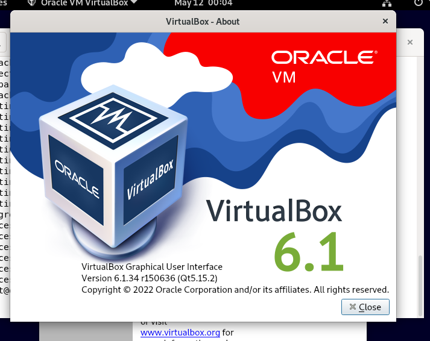

Задача 1
Опишите своими словами основные преимущества применения на практике IaaC паттернов.
Какой из принципов IaaC является основополагающим?

Ответ 1
Основные преимущества IaaC, на мой взгляд:
1) Автоматизация рутинных процессов при создании инфраструктуры для разработчиков и тд
Представляет собой представление инфраструктуры как кода.
2) Идемпотентность - предсказуемый результат от автоматизации (основополагающий принцип IaaC)

Задача 2
Чем Ansible выгодно отличается от других систем управление конфигурациями?
Какой, на ваш взгляд, метод работы систем конфигурации более надёжный push или pull?

Ответ 2
Преимущество Ansible заключается в отсутствия необходимости установки на управляемые хосты каких либо агентов(использование метода push), а использование для управления ssh исключается необходимость накручивать PKI.
Если рассуждать о надежности, то все зависит от рук, которые делают. В push-модели сам сервер управления инициирует какие-либо управляюще действия на подчиненных серверах. Соответственно при выходе его из строя - карета превращается в тыкву. Следует делать упор на отказоустойчивость - кластеризация, регулярное бекапирование, возможно наличие актуальной реплики, на которую можно перейти в случае выхода из строя критичного сервера.
В pull-модели наоборот управляемые хосты инициируют получение какой-либо для себя необходимой конфигурации. 

Задача 3
Установить на личный компьютер:

VirtualBox
Vagrant
Ansible
Приложить вывод команд установленных версий каждой из программ, оформленный в markdown.

Ответ 3
ansible:
root@debian11-tst:~# ansible --version

ansible [core 2.12.5]
  config file = None
  configured module search path = ['/root/.ansible/plugins/modules', '/usr/share                                                                                                                                                             /ansible/plugins/modules']
  ansible python module location = /usr/local/lib/python3.9/dist-packages/ansibl                                                                                                                                                             e
  ansible collection location = /root/.ansible/collections:/usr/share/ansible/co                                                                                                                                                             llections
  executable location = /usr/local/bin/ansible
  python version = 3.9.2 (default, Feb 28 2021, 17:03:44) [GCC 10.2.1 20210110]
  jinja version = 3.1.2
  libyaml = True

vagrant:
root@debian11-tst:~# vagrant -v

Vagrant 2.2.19

virtualbox:

